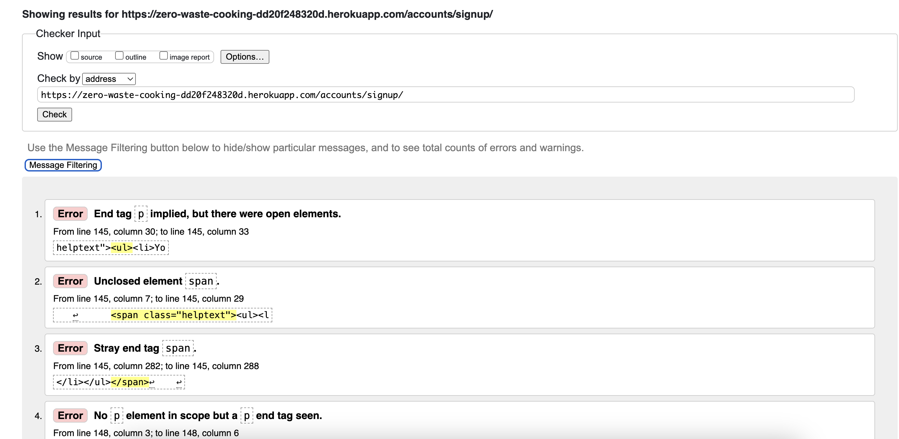

# Zero Waste Cooking

Welcome to the Zero Waste Cooking project! This Django-based web application aims to promote sustainable cooking practices by helping users discover recipes based on ingredients they already have, reducing food waste and promoting a more environmentally friendly approach to cooking.

[View the live project here](https://zero-waste-cooking-dd20f248320d.herokuapp.com/)
(To open in a new tab/ window, press "ctrl" (or ⌘ for Mac) + click on the link)

 

## Table of Contents

- [About the Site](#about-the-site)
  - [Primary Goal](#primary-goal)
  - [Target Users](#target-users)
- [Agile Methodology](#agile-methodology)
  - [Workflow Breakdown](#workflow-breakdown)
  - [All User Stories](#all-user-stories)
- [Five Planes of User Experience (UX)](#five-planes-of-ux)
  - [1. Strategy Plane](#1-strategy-plane)
    - [1.1 Goal](#11-goal)
    - [1.2 User Needs](#12-user-needs)
    - [1.3 Business Goals](#13-business-goals)
  - [2. Scope Plane](#2-scope-plane)
    - [2.1 Key Existing Features](#21-key-existing-features)
    - [2.2 Out of Scope](#22-out-of-scope)
  - [3. Structure Plane](#3-structure-plane)
    - [3.1 Landing Page with Navbar](#31-landing-page-with-navbar)
    - [3.2 Tagline](#32-tagline)
    - [3.3 Blog Post Page](#33-blog-post-page)
    - [3.4 Recipe Page](#34-recipe-page)
    - [3.5 About Page](#35-about-page)
    - [3.6 Footer](#36-footer)
    - [3.7 Navigation](#37-navigation)
  - [4. Skeleton Plane](#4-skeleton-plane)
    - [4.1 Layout Design](#41-layout-design)
    - [4.2 Desktop, Tablet & Mobile View and Differences](#42-desktop-tablet--mobile-view-and-differences)
  - [5. Surface Plane](#5-surface-plane)
    - [5.1 Wireframes](#51-wireframes)
    - [5.2 Color Scheme](#52-color-scheme)
    - [5.3 Typography](#53-typography)
    - [5.4 Imagery](#54-imagery)
- [Technologies Used](#technologies-used)
  - [Languages Used](#languages-used)
  - [Frameworks, Libraries & Programs Used](#frameworks-libraries--programs-used)
- [Testing](#testing)
  - [Google Lighthouse Performance](#google-lighthouse-performance)
  - [HTML Validation](#html-validation)
  - [CSS Validation](#css-validation)
  - [Javascript Validation](#javascript-validation)
  - [Python Validation](#python-validation)
  - [Bugs & Fixes](#bugs--fixes)
- [Deployment](#deployment)
- [Credits](#credits)

## About the Site

### Primary Goal

The Zero Waste Cooking website aims to reduce food waste and promote more environmentally friendly cooking habits by providing a platform for users to discover recipes based on ingredients they already have, share their own recipes, and learn about sustainable cooking practices.

### Target Users

Our target audience includes:

- Anyone looking to save money by making the most of their existing ingredients
- Home cooks of all skill levels seeking inspiration for meal preparations using available ingredients
- People interested in sharing their own zero-waste recipes and cooking tips
- Environmentally conscious individuals looking to reduce food waste

## Agile Methodology
The Zero Waste Cooking project was managed using Agile methodologies to ensure a user-centered, iterative, and organised development process. I used a [Kanban board on GitHub](https://github.com/users/waiyiwong/projects/3/views/1) to track user stories and progress through four stages: "Backlog", "To Do", "In Progress", and "Done".
Each user story was categorised using the MoSCoW prioritisation method and labeled accordingly as "Must Have", "Should Have", "Could Have", or "Won't Have". Stories were documented with clear Descriptions and Acceptance Criteria(AC) to define completion standards.

### Workflow Breakdown
1.	Backlog: All user stories were initially added here with labels indicating their MoSCoW prioritisation. 
> For example: 
> User Story #1: Search for recipes by ingredients

>Description:  As a user, I want to search for recipes based on ingredients I have available, so that I can use up what I have and avoid food waste.

>Acceptance criteria (AC) 
AC 1: The search bar should allow users to enter ingredient. 
AC 2: The search results should be filtered by the ingredient entered. 
AC 3: If no recipes match the entered ingredient, display a message indicating that no results were found.

2.	To Do: "Must Have" stories were prioritised first, followed by "Should Have" and "Could Have," while "Won't Have" items were excluded from the "to-do" list. Development began with "Must Have" stories, with "Should Have" planned for the second sprint and "Could Have" reserved for the third iteration.
3.	In Progress: Active tasks focused on meeting the MVP requirements. This column included all "Must Have" and "Should Have" stories currently being worked on.
4.	Done: User stories were moved to this column once all acceptance criteria were successfully met and tested.

The following table summarises the user stories, their prioritisation, and their associated sprints:
| #  | Title of User Story                                | MoSCoW Prioritisation | Sprint Number |
|----|--------------------------------------|------------------------|---------------|
| 1  | Search for recipes by ingredients    | Should Have            | Sprint 2      |
| 2  | Show the main purpose of the site    | Must Have             | Sprint 1      |
| 3  | Sign up as a member                  | Must Have             | Sprint 1      |
| 4  | Share recipes with the community     | Should Have            | Sprint 2      |
| 5  | Save favorite recipes                | Could Have            | Sprint 3      |
| 6  | Comment on recipes and engage        | Must Have             | Sprint 1      |
| 7  | Sign in as members                   | Must Have             | Sprint 1      |
| 8  | Scan food barcode to log ingredients | Won't Have            | N/A           |
| 9  | Show nutrition value and calories    | Won't Have            | N/A           |
| 10 | See blog posts and recipes posted by the admin      | Must Have             | Sprint 1      |
| 11 | Sign-in to see personal profile page | Could Have            | Sprint 3      |

### All User Stories

- (MVP) Show the main purpose of the site: As a first-time visitor, I want to easily understand the main purpose of the site and learn more about zero-waste cooking, so that I can decide whether to use it or not.
- (MVP) See recipes and blog posts: As a user, I want to be able to see recipes and blog posts, so that I can learn more about zero-waste recipes and cooking techniques.
- (MVP) Sign up as a member to comment: As a user, I want to sign up as a member, so that I can comment on recipes and posts.
- (MVP) Sign in to post, edit, and delete posts and comments: As a logged-in user, I want to be able to post, edit, and delete posts and comments.
- (MVP) Comment on recipes and engage with other users: As a user, I want to be able to comment on recipes and engage with other users, so that I can learn from others, share my tips, and build a community around zero-waste cooking.
- Search for recipes by ingredients: As a user, I want to search for recipes based on ingredients I have available, so that I can use up what I have and avoid food waste.
- Share recipes with the community: As a registered user, I want to be able to share my own recipes with the community, so that I can contribute to the site and help others.
- Save favorite recipes: As a user, I want to be able to save my favorite recipes for easy access later, so that I can quickly find and cook the recipes I enjoy.
- Sign-in to see my personal profile page: As a user, I want to be able to sign in to the app so that I can access my personal information and settings.
- Scan food barcode to log ingredients: As a user, I want to be able to scan the barcode of a food item, so that I can easily log its ingredients.
- Show nutrition value and calculate calories: As a user, I want to be able to see the nutrition value of a food item and calculate its calories, so that I can make informed choices about what I eat.

## User Experience (UX)

### **Five Planes of UX**
### 1. Strategy Plane

#### 1.1 Goal:
Help users reduce food waste by finding recipes based on available ingredients.

#### 1.2 User Needs:
- Reduce food waste by finding recipes with available ingredients.
- Access sustainable cooking tips and recipes.
- Engage with other users through comments and sharing.
- Learn about zero-waste cooking practices.

#### 1.3 Business Goals:
- Encourage sustainability in the kitchen.
- Increase user engagement with community recipes and tips.
- Promote a lifestyle change that benefits both users and the environment.

---

### 2. Scope Plane

#### 2.1 Key Existing Features

1. **Responsive Navigation Bar**: Allows users to easily navigate the site on all devices.
2. **User Authentication**: Enables users to register, log in, and log out.
3. **Recipe Search**: Allows users to search for recipes based on available ingredients.
4. **Dietary Preference Search**: filters dietary restrictions and cuisine type
5. **Recipe Details Page**: Displays full recipe information, including ingredients, instructions, and user comments.
6. **Commenting System**: Allows users to engage with recipes by leaving comments.
7. **Responsive Design**: Ensures the site is fully functional and visually appealing on all device sizes.

#### 2.2 Out of Scope:
- Barcode scanning for ingredient logging.
- Nutrition value and calorie calculation.
- Recipe rating system
- Like and add-to-favourite buttons
- User Profile page
- Social media sharing integration
- User Recipe Management (edit and delete)

---

### 3. Structure Plane
**Website Structure:**
#### 3.1 Landing Page with Navbar:
The landing page features a hero image that visually communicates the purpose of the site — promoting zero waste cooking. It highlights the benefits of sustainable cooking practices, offering users an introduction to the core values of zero waste cooking.

#### 3.2 Tagline:
"Cook Hero, Waste Hero" — A tagline that encapsulates the spirit of sustainable and mindful cooking, encouraging users to become heroes in their kitchens and for our planet by reducing waste.

#### 3.3 Blog Post Page:
This page shares zero waste cooking tips, practical advice on reducing food waste, and insights into sustainable practices. It serves as an educational hub for visitors seeking to improve their cooking habits.

#### 3.4 Recipe Page:
The recipe page features zero waste cooking recipes, detailed instructions, and options for dietary preferences. The goal is to provide easy-to-follow, eco-conscious recipes that help users reduce waste in the kitchen.

#### 3.5 About Page:
Learn about the origins of the Zero Waste Cooking website, the motivations behind creating this platform, and the community it seeks to build. The page includes a call to join the zero waste community and a contact form with validation to ensure user inquiries are received and addressed.

#### 3.6 Footer:
The footer includes essential copyright information and social media links for users to stay connected and engage with the Zero Waste Cooking community online.

#### 3.7 Navigation:
Simple top navbar with links to landing page, recipes, blog, about page, and user login/sign up.

---

### 4. Skeleton Plane

#### 4.1 Layout Design:
- **Hero Section**: Hero image with Tagline “Cook Hero, Waste Hero” and a short persuasive message to call for action.
- **Responsive Grid**: Adaptable grid ensuring readability and usability across all devices.
- **Navbar**: Collapsible menu for mobile devices, with clear navigation.
- **Recipe List**: Cards displaying recipe titles, pictures, type of cuisines, and dietary preferences.
- **Blog**: Engaging posts with images and text on sustainable cooking.
- **Commenting System**: Simple interface for users to engage with recipes and blog posts.

#### 4.2 Desktop, Tablet & Mobile View and Differences

Bootstrap 5.3.3 was implemented to ensure full responsiveness across all devices. Key features include:

- Fluid containers and a responsive grid system that adapt to screen sizes.
- Content stacks vertically on mobile devices, while multi-column layouts are used on larger screens.
- The navbar transforms into a collapsible hamburger icon on smaller screens for easy navigation.

This approach provides an optimal viewing experience, maintaining readability and usability with minimal resizing and scrolling across all devices.

---

### 5. Surface Plane-- Design Elements

#### 5.1 Wireframes

Wireframe - Homepage Desktop & Mobile

#### 5.2 Color Scheme

The color scheme focuses on sustainability, complemented by a natural, organic feel.

- Background Colors: #252426 & #F9FAFC
- Primary Color: #80A665
- Secondary Color: #FBFFFA
- Text Color: #577F40 & #ACC58E

[Adobe Color](https://color.adobe.com/create/color-wheel) is used to generate color scheme.

[Adobe Color](https://color.adobe.com/create/color-contrast-analyzer) checks the color contrast (accessibility) of the site.

For Dark Background

For Light Background

#### 5.3 Typography

The site uses a clean, modern "League Gothic", serif fonts for easy readability across devices. [Google Fonts](https://fonts.google.com/) is used to import the fonts.

#### 5.4 Imagery

I used AI image generation (via Freepik) to create the majority of the images on the site. These AI-generated images served as the foundation for redesigning and customizing the logo, hero image, and post images. The final designs were refined by myself using Adobe Fresco and Canva. 
The recipe imagery throughout the site is focused on fresh ingredients, completed dishes, and sustainable cooking practices.

## Technologies Used

### Languages Used

- HTML5
- CSS3
- JavaScript
- Python

### Frameworks, Libraries & Programs Used

1. [Django](https://www.djangoproject.com/): The main framework used to build the project.
2. [PostgreSQL](https://www.postgresql.org/): Database used to store recipe and user data.
3. [Bootstrap](https://getbootstrap.com/): Used for responsive design and styling.
4. [Git](https://git-scm.com/): Used for version control.
5. [GitHub](https://github.com/): Used to store the project repository.
6. [Cloudinary](https://cloudinary.com/): Used for image hosting and management. (If implemented)
7. [Gunicorn](https://gunicorn.org/): Used as the HTTP server for deploying the Django application.
8. Google Dev Tools - to debug and for testing responsiveness 
9. [Am I Responsive](https://ui.dev/amiresponsive) and [Ignore X-Frame Headers Extension](https://chromewebstore.google.com/detail/ignore-x-frame-headers/gleekbfjekiniecknbkamfmkohkpodhe) - to acquire the responsiveness screenshot

## Testing
To ensure the functionality and reliability of the site, both automated and manual testing were adopted throughout the development process. 

Automated tests were implemented to check for common issues and verify the integrity of key features. 

Manual testing was performed on various devices, including the iPhone 15 Pro, Sony Xperia, iPad Pro, MacBook Air, and MacBook Pro, to assess the site's responsiveness, accessibility, and user experience across different screen sizes and platforms. This combination of automated and manual testing ensures the site’s performance and quality are maintained across a range of devices.

### Google Lighthouse performance
for auditing the website

Google Lighthouse Performance Score
  

   

### HTML Validation
[W3C HTML Validation](https://validator.w3.org/) is used to validate html codes for all pages

Screenshots of all HTML validations
  

Blog page

Recipe page

About page

The W3C Validator shows 5 errors related to the obsolete `` tag. These are generated by the rich-text editor, not the project's custom code. They do not impact functionality but stem from legacy HTML rendering by the editor.

Sign up page

The W3C Validator flagged errors like unclosed tags and stray end tags, but these issues are not present in my source code. All elements and closing tags are correctly structured. The errors likely stem from how the validator interprets the rendered HTML.

Sign in page

Sign out page

### CSS Validation
[Jigsaw](https://jigsaw.w3.org/css-validator/) is for validating my CSS

CSS validation
  

### Javascript Validation

JS validation
  

   

### Python Validation
[Pep8](https://pep8ci.herokuapp.com/) is used to validate if my python code meet Pep8 Standards

Python validation
  

  

### **Bugs & Fixes**
- Failed to render recipe app (- check all python files in recipe app and project level urls.py, seek help from Google, chatGPT and Slack community)
- Failed to load images when debug mode switched from true to false (1. check all python files in recipe app and project level urls.py, seek help from Google, chatGPT and Slack community. 2. make sure all images file in static folder and correct directory and then run command in terminal "python3 manage.py collectstatic". )
- Failed to load cloudinary images after deploying to Heroku (- Set Config Vars and Cloudinary_URL on Heroku)

### **Unsolved Bugs**

## Deployment

### Deploying to Heroku

This project is deployed on Heroku. Here are the steps to deploy:

1. Create a Heroku account and log in.
2. Click "New" and select "Create new app".
3. Choose a name for my app and select my region.
4. In the "Deploy" tab, connect your GitHub repository.
5. In the "Settings" tab, add the following config vars:
   - SECRET_KEY: My Django secret key
   - DATABASE_URL: My PostgreSQL database URL
   - CLOUDINARY_URL: My Cloudinary URL
6. Add the Python buildpack to your app.
7. In the "Deploy" tab, click "Deploy Branch" to deploy my app.

## Credits

### Code

- [Django Documentation](https://docs.djangoproject.com/): Used extensively for guidance on Django best practices and implementation.
- [Bootstrap Documentation](https://getbootstrap.com/docs/): Used for responsive design components and styling.

### Content

- All recipe content is added by the site admin for demonstration purposes.

### Media

- Default recipe images and site graphics are sourced from [Freepik](https://www.freepik.com/) and [Fontawesome](https://fontawesome.com/).

### AI Assistance
- V1
- ChatGPT

### Projects for Inspiration
I have drawn some inspiration from these projects
https://github.com/Dee-McG/Recipe-Tutorial
https://github.com/amylour/FreeFido_v2

### Acknowledgements

- SME (Mark), coding coach (John and Roo) and facilitators (Marko, Shelly, Vasi) for continuous helpful feedback.
- The Code Institute Slack community for their support and advice.